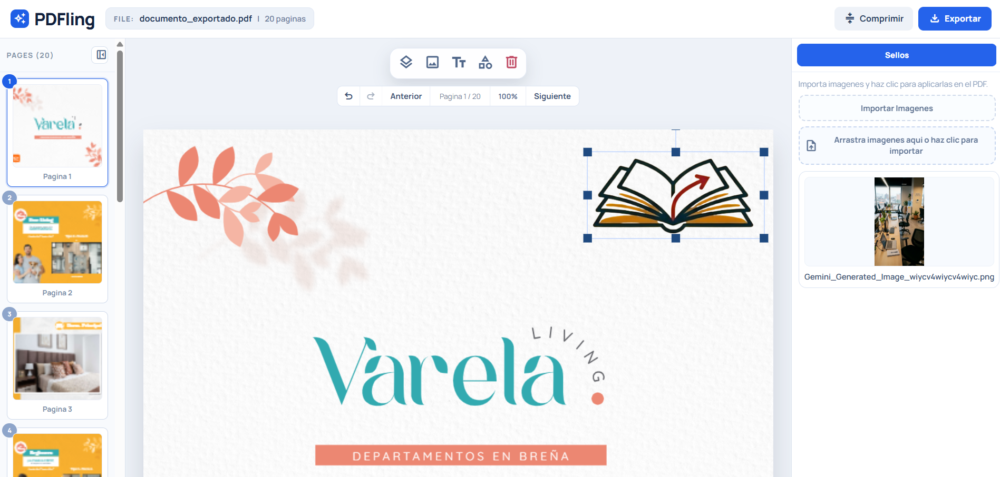

# PDFling

Editor de PDF para Chrome Extension (Manifest V3), enfocado en productividad documental, procesamiento local y una experiencia visual de mesa de trabajo.



## Resumen

PDFling permite abrir y trabajar PDFs dentro de una extension de Chrome sin depender de servicios externos para el flujo principal de edicion. El proyecto prioriza:

- velocidad operativa para equipos
- control sobre el resultado final
- privacidad al procesar informacion en local

## Funcionalidades actuales

- Carga y visualizacion de PDFs por pagina
- Herramientas de anotacion sobre lienzo
- Agregar texto libre
- Insertar figuras geometricas (rectangulo, elipse, triangulo)
- Configurar color, tamano y borde redondeado de figuras
- Atajos y controles de deshacer/rehacer
- Exportacion del PDF con anotaciones aplanadas
- Historial local reciente para recuperacion de contexto
- Soporte de idioma ES/EN en popup
- Tema claro/oscuro sincronizado entre popup y workspace

## Arquitectura

El proyecto esta organizado en modulos TypeScript con separacion por responsabilidad:

- `src/background/`: service worker y coordinacion de extension
- `src/popup/`: interfaz inicial, acciones y configuraciones
- `src/workspace/`: editor principal tipo mesa de trabajo
- `src/services/`: servicios de PDF, IA y almacenamiento
- `src/shared/`: contratos de mensajeria, errores y utilidades comunes

## Stack tecnico

- TypeScript
- Webpack
- Chrome Extension Manifest V3
- `pdfjs-dist`
- `pdf-lib`
- `fabric`

## Inicio rapido

Requisitos:

- Node.js 18+
- npm 9+
- Chrome o navegador compatible con extensiones Chromium

Instalacion y build:

```bash
npm install
npm run build
```

Carga local de extension:

1. Abre `chrome://extensions`.
2. Activa `Developer mode`.
3. Selecciona `Load unpacked`.
4. Elige la carpeta `dist/`.

## Desarrollo

Compilacion en modo desarrollo (watch):

```bash
npm run dev
```

Build de produccion:

```bash
npm run build
```

## Estructura del repositorio

```text
.
|-- src/
|   |-- background/
|   |-- popup/
|   |-- services/
|   |-- shared/
|   `-- workspace/
|-- manifest.json
|-- webpack.config.js
`-- README.md
```

## Documentacion del proyecto

- Contribucion: `CONTRIBUTING.md`
- Seguridad: `SECURITY.md`
- Codigo de conducta: `CODE_OF_CONDUCT.md`
- Historial de cambios: `CHANGELOG.md`
- Licencia: `LICENSE`

## Roadmap sugerido

- Optimizacion para documentos de gran tamano
- Mas herramientas de anotacion colaborativa
- Pruebas automatizadas para flujo de exportacion
- Metricas de uso local para mejora de UX

## Contribuir

Se aceptan mejoras de UX, rendimiento, arquitectura y documentacion. Revisa `CONTRIBUTING.md` antes de abrir cambios.

## Seguridad y privacidad

PDFling esta disenado para procesar documentos en local siempre que sea posible. Si detectas una vulnerabilidad, reportala via `SECURITY.md`.

## Licencia

Este proyecto se distribuye bajo licencia MIT. Consulta `LICENSE` para detalle legal.
